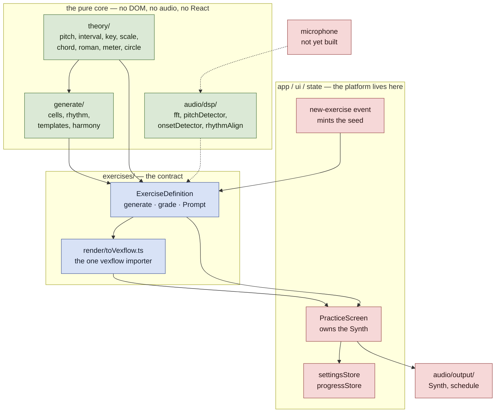
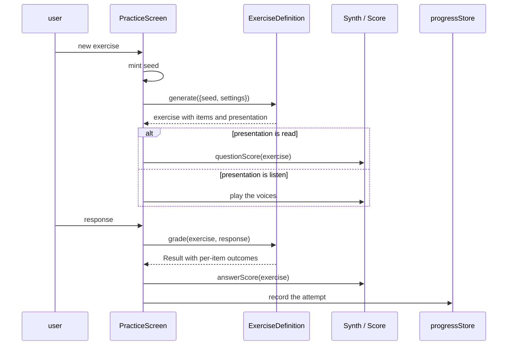
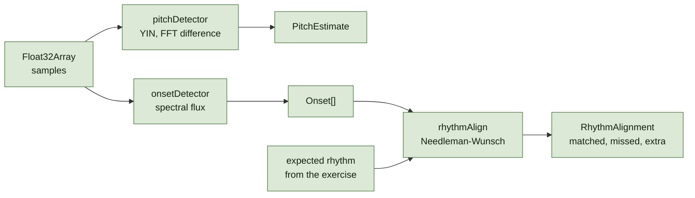

# Architecture

A practice app for musicians. It generates an exercise, puts it to the user
either on the staff or through the speaker, listens to them play it on a real
instrument, and records what that says about the things they are learning.

This document describes the shape as it stands. Decisions that would be
expensive to reverse live in [`docs/adr/`](adr/README.md) and are linked from
here; where the two disagree the ADR is the record of what was decided and this
file is what is true today.

## The one constraint

Three directories — [`src/theory/`](../src/theory), [`src/generate/`](../src/generate)
and [`src/audio/dsp/`](../src/audio/dsp) — import nothing from the layers above
them and nothing from the platform. No DOM, no `AudioContext`, no React, no
persistence. They take plain data and return plain data
([ADR 0001](adr/0001-a-pure-core.md)).

That is roughly half the codebase, and it is the half where every interesting
claim lives: whether a Db melodic minor is spelled correctly, whether a
generated progression cadences, whether YIN finds the right fundamental in a
recorded note. All of it runs under vitest on a laptop in milliseconds, with no
browser and no microphone, which is what makes property tests over thousands of
seeds affordable rather than aspirational.

Dotted arrows are built but not yet wired: the analysis chain is complete and
tested, and nothing captures audio into it yet.

### How the boundary is kept

It is a convention, not a module boundary — nothing in TypeScript stops a
branch importing `document` into the generator. So it is asserted instead, by
[`src/architecture.test.ts`](../src/architecture.test.ts), which walks the
filesystem (an untracked file breaches the rules too), blanks comments before
scanning (the rules match prose otherwise), and asks all three records of the
repository on every run.

That file has carried three defects of its own, each of which let through the
breach it existed to stop, and each found by mutating a *branch* of a rule
rather than the rule. It is worth treating as code that needs testing rather
than as the thing that does the testing.

## What happens when the user practises

The seed is minted above the core, at the moment the user asks for a new
exercise, and handed in ([ADR 0005](adr/0005-seeds-are-minted-outside-the-core.md)).
Everything downstream of it is a pure function of `(seed, settings)`
([ADR 0002](adr/0002-generation-is-reproducible-from-its-seed.md)), so an
exercise a user reports by its seed reproduces exactly.

`generate` and `grade` are both pure and both live outside the component.
Keeping `grade` out of an `onClick` is what makes it property-testable, and it
is where every claim an exercise makes actually sits.

## The exercise contract

[`src/exercises/types.ts`](../src/exercises/types.ts) says what an exercise type
is, as a contract rather than a convention. There will be six — sight reading,
note identification, rhythm, chord, chord progression, scale — and the intent
is that the sixth costs almost nothing.

The seams it defines:

| Seam | Why it is a seam |
| --- | --- |
| `generate(spec)` | Takes `(seed, settings)` and nothing else, so an exercise is reproducible |
| `grade(exercise, response)` | Pure, so it can be property-tested away from the UI |
| `settings.fields` | A *description* of the settings, so one generic panel serves every type |
| `settings.coerce` | Total function from `unknown`, because stored settings outlive the release that wrote them |
| `Prompt` | The only per-exercise component; handed audio rather than reaching for it |
| `questionScore` / `answerScore` | Engraving stays on the definition so `exercises/` never imports `ui/` |

The last one is load-bearing for [ADR 0003](adr/0003-one-importer-for-the-notation-library.md).
A prompt that rendered its own stave would make `exercises/` import `ui/` import
`exercises/render/`, and the containment is easiest to keep while that arrow
points one way.

**The evidence so far is good.** Two exercises exist. The second,
[`key-id`](../src/exercises/key-id), is 356 lines of non-test source and
required no change to the screen, the settings panel or the attempt log —
[`registry.ts`](../src/exercises/registry.ts) gained one import and one array
entry. That is the claim holding up under its first real test.

One leak is closed: a card whose blurb is not listed in
[`ui/menu.ts`](../src/ui/menu.ts) now falls back to the definition's own
`description` rather than to the empty string, so a sixth exercise cannot ship
with a blank card.

### Presentation

Every exercise can be asked two ways: `read`, where the question is on the staff
and nothing sounds, and `listen`, where it sounds and the staff stays empty
until the answer is given. These are different skills — a learner can be fluent
at one and hopeless at the other — so it is a setting rather than a house style,
and a definition declares which senses it supports.

It is carried on the generated exercise rather than read from settings at render
time, because changing the setting mid-question must not change the question,
and because **an attempt is only comparable with another attempt asked the same
way** ([ADR 0010](adr/0010-presentation-is-part-of-what-an-attempt-means.md)).

That is now carried through: `presentation` is a named, validated field on the
stored attempt rather than something dug out of an opaque settings blob, and
[`tallyItems`](../src/state/progressStore.ts) keys on `(presentation, item)`
through `tallyKey`, so reading a third and hearing one are counted separately.
The presentation stays *outside* the `ItemId`, because ids are a compatibility
commitment and one encoding two orthogonal things cannot change along one axis
without breaking the other. Making it a field meant the app's first schema
migration, v1 to v2.

## What an attempt records

Per item, not per exercise ([ADR 0007](adr/0007-an-attempt-records-per-event-item-attribution.md)).
A sight-reading bar tests a key signature, a dozen intervals and several
rhythmic cells at once, and the user plays it once; credit and blame have to
localise or the schedule punishes six things for one wrong note.

Two lists, deliberately distinct. `Exercise.items` is everything the rendering
*contained*; `Result.outcomes` is only what the response actually *tested*.
Keeping both is what lets the schedule tell "never shown" from "shown and not
tested".

An [`ItemId`](../src/exercises/types.ts) is a colon-joined path —
`interval:m3:up`, `chord:dom7:inv2` — and keys the user's review history, which
makes it a compatibility commitment from the first release. Renaming one
silently orphans everything the user has learned about it.

## Persistence

Split by what the data is, not by convenience
([ADR 0006](adr/0006-settings-in-localstorage-progress-in-indexeddb.md)):
settings in `localStorage`, the attempt log in IndexedDB.

Both sit behind two small interfaces in
[`persistence.ts`](../src/state/persistence.ts) — `Slot<T>` for a single value,
`Log<T>` for an append-only series. Each has a memory implementation, which is
what the app falls back to when a device will not open a database. A fallback
that behaves differently from the thing it replaces is not a fallback, so the
promises are written once in [`logContract.ts`](../src/state/logContract.ts) and
both implementations are made to keep them.

## The analysis chain

Built and tested, not yet wired to a microphone. All of it is pure arithmetic
over sample arrays, which is the point — it is verified against synthesised and
recorded signals off-device rather than by playing into a laptop.

The detector is ported from the sibling `tuner` project, whose own ADRs record
what each constant was measured against. Those numbers are measurements rather
than preferences: changing one means re-running the recordings corpus, not
re-reading the code. The onset threshold floor
([ADR 0008](adr/0008-an-onset-is-a-rise-in-the-frames-own-spectrum.md)) and the
alignment ([ADR 0009](adr/0009-align-a-performance-by-dynamic-programming.md))
were decided here and have records of their own.

Aligning by dynamic programming rather than by nearest-neighbour matters because
a player who drops a note should be told they dropped a note, not have every
subsequent onset counted wrong.

## Generation

`generate/` chooses; `theory/` knows. The division is that `theory/` contains
facts that are checkable against music theory, and `generate/` contains
decisions with no single right answer.

Harmony is kept symbolic — roman numerals, realised into spelled pitches as late
as possible ([ADR 0004](adr/0004-harmony-stays-symbolic-until-it-is-spelled.md)).
A generator working in pitch classes could not know whether the middle note of
V/V in C was meant as F# or Gb, and the whole investment in spelled pitches
would be wasted at the point of use.

Because `generate/` has no ground truth, its tests assert constraints and never
aesthetics: that a suspension resolves down by step, not that a particular seed
produces a particular tune. A test that pinned the weights would make tuning
impossible.

Three of its files are catalogues of musical data rather than code —
[`cells.ts`](../src/generate/cells.ts) (the figures a bar is built from),
[`templates.ts`](../src/generate/templates.ts) (33 progressions) and
[`patterns.ts`](../src/generate/patterns.ts) (26 named whole-bar rhythms). The
catalogue is the product and the generator is plumbing: twenty correct
templates are worth more than any cleverness in the thing that reads them.
[ADR 0011](adr/0011-what-a-catalogue-owes.md) says what one owes — construction-time
well-formedness, stable ids, asserted musical claims, and reachability. That
last is the one none of them pays: three of the thirty-three templates declare
a closing cadence the phrase planner never asks for by default, so on the
default path they cannot be shown.

## What is not built

- **Nothing captures audio.** `audio/dsp/` is complete and unused; there is no
  microphone, worklet or capture layer, so no exercise is yet answered by
  playing it.
- **Four of six exercise types.** Sight reading, note identification, rhythm,
  chord, progression and scale are listed in the menu as planned; two exist.
- **Spaced repetition.** Designed in [`docs/ROADMAP.md`](ROADMAP.md), with the
  seam it attaches to already in place — `grade` returns outcomes rather than a
  score precisely so the scheduler has somewhere to attach.
- **The shipping targets.** `CLAUDE.md` describes a PWA and an Android APK.
  `vite-plugin-pwa` is a declared dependency that `vite.config.ts` never
  imports, and the `android:*` npm scripts invoke `npx cap` with no Capacitor
  dependency, no `capacitor.config.*` and no `android/` directory. Today the
  app builds as neither.
