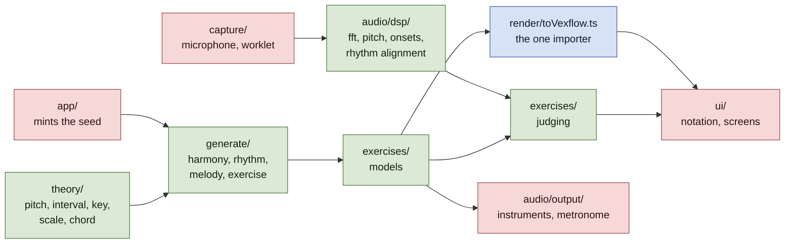

# Architecture decision records

One record per decision that would be expensive to reverse or puzzling to
inherit. Records are **append-only**: once a record is published its argument is
never rewritten, only its status changed to `Superseded by NNNN`. A later
decision that narrows an earlier one says so on its own face.

Numbering is sequential, four digits, and never reused. **Claim a number before
you write, with `.claude/scripts/fleet.sh adr-claim "<title>"`.** It allocates
against every number that exists anywhere — on any branch, in any worktree's
working tree including an uncommitted draft, and in the claims file — rather
than against what anyone remembers agreeing. Reserving by message does not work:
a reservation and the work it was meant to protect can cross in flight.
`fleet.sh adr-taken` shows who holds what.

| # | Decision | Status |
| --- | --- | --- |
| [0001](0001-a-pure-core.md) | A pure core: theory, generate and dsp import nothing above themselves | Accepted |
| [0002](0002-generation-is-reproducible-from-its-seed.md) | Generation is reproducible from its seed | Accepted |
| [0003](0003-one-importer-for-the-notation-library.md) | One importer for the notation library | Accepted |
| [0004](0004-harmony-stays-symbolic-until-it-is-spelled.md) | Harmony stays symbolic until it is spelled | Accepted |
| [0005](0005-seeds-are-minted-outside-the-core.md) | Seeds are minted outside the core | Accepted |
| [0006](0006-settings-in-localstorage-progress-in-indexeddb.md) | Settings in localStorage, progress in IndexedDB | Accepted |
| [0007](0007-an-attempt-records-per-event-item-attribution.md) | An attempt records per-event item attribution | Accepted |
| [0008](0008-an-onset-is-a-rise-in-the-frames-own-spectrum.md) | An onset is a rise in the frame's own spectrum | Accepted |
| [0009](0009-align-a-performance-by-dynamic-programming.md) | Align a performance by dynamic programming, not by nearest neighbour | Accepted |
| [0010](0010-presentation-is-part-of-what-an-attempt-means.md) | Presentation is part of what an attempt means | Accepted |
| [0011](0011-what-a-catalogue-owes.md) | What a catalogue owes | Accepted |
| [0012](0012-the-judge-consumes-performed-notes-not-audio.md) | The judge consumes performed notes, not audio | Accepted |
| [0013](0013-knowing-the-answer-narrows-what-judging-has-to-do.md) | Knowing the answer narrows what judging has to do | Accepted |
| [0014](0014-one-clock-and-the-latency-nobody-can-measure.md) | One clock, and the latency nobody can measure | Accepted |
| [0015](0015-state-keyed-to-the-exercise-type-must-not-outlive-it.md) | State keyed to the exercise type must not outlive it | Accepted |
| [0016](0016-widen-the-query-not-the-corpus.md) | Widen the query, not the corpus, and only when it pays on its own | Accepted |
| [0017](0017-a-setting-that-excludes-is-not-a-corpus-you-cannot-reach.md) | A setting that excludes is not a corpus you cannot reach | Accepted |
| [0018](0018-uncalibrated-is-not-zero.md) | Uncalibrated is not zero | Accepted |
| [0019](0019-the-click-gap-stays-the-callers-and-the-margin-stops-being-a-comment.md) | The click gap stays the caller's, and the margin stops being a comment | Accepted |

**Check a claim about the code against the code, not against the record that
made it.** One unchecked reading of `CLAUDE.md` became four wrong documents in
two days: 0012 read a description of what `audio/dsp/` is *for* as a statement
of what it holds, 0013 cited 0012, this index drew it, and the published report
repeated it. No single step looked like an invention, and the claim — that the
DSP layer computes chroma, which it does not — was load-bearing for an exercise
about to be built on it. Both records now carry dated corrections.

**Scope a guard to what can actually change the thing it guards.** A check that
fires on changes it should ignore is not merely annoying: the noise is how it
comes to be ignored, and an ignored check is worse than none, because everyone
believes it is still running. Three instances in one day, all the same shape —
the layering rule matched the word "window" in a sentence about a signal frame,
and the report's staleness check cried wolf twice, once comparing the bundle
against `HEAD` rather than against the files that can change it, and once
counting test files that are never bundled. Each was narrowed after it had
already taught someone to skim past it.

**But distinguish a guard from a definition, because this convention read
carelessly argues for deleting the wrong things.** A guard asserts a property of
the system as it stands, so scope it to what can change that property — and if
nothing can, it is a tautology and should go, which is why the menu test that
compared a derived name against the name it was derived from was deleted rather
than kept as documentation. A definition answers a question over a domain, and
is tested over that domain rather than over the inputs its current callers
happen to produce. `isBorrowedIn` says whether a chord is a loan from the
parallel mode; that `vii°` in minor is not one is true whether or not any
template writes it today, so the branch is an untested corner and not dead code.

The test that separates them: **can this fail for some input in its domain, or
only for inputs the present system cannot construct?** The first is a corner
worth covering. The second is a tautology wearing a corner's clothes.

The two conventions pull in opposite directions, and that is the point. The
first says check more; the second says check *exactly*. A guard that is broad
enough to be noisy and a claim that is never checked at all fail in the same
place — at the moment someone decides the signal is not worth reading.

[`docs/ARCHITECTURE.md`](../ARCHITECTURE.md) describes the system as it stands
today and links back to these records. It is a living document: when a record
and it disagree, the record says what was decided and ARCHITECTURE.md says what
is true now.

## The shape of the thing

The green boxes are plain TypeScript over plain data: no DOM, no
`AudioContext`, no React, no persistence. That is what lets the whole music
engine and the whole analysis chain run under vitest on a laptop
([0001](0001-a-pure-core.md)), and it is the constraint most worth protecting.
Everything the platform supplies enters at the edges, and the notation library
enters at exactly one file ([0003](0003-one-importer-for-the-notation-library.md)).

The seed is drawn red deliberately. Minting one is the single act of
nondeterminism in the whole pipeline, and since
[0005](0005-seeds-are-minted-outside-the-core.md) it happens above the core and
is handed in — so the arrow into `generate/` is the entropy boundary, not just
another dependency.



None of the three is a module boundary — nothing in the language stops a later
branch importing `document` into the generator — so each is worth being able to
ask of the repository directly:

```bash
# 0001 — nothing in the core reaches for the platform.
grep -rn 'document\.\|window\.\|AudioContext\|navigator\.\|localStorage' \
  src/theory src/generate src/audio/dsp

# 0002, narrowed by 0005 — no entropy reaches the core at all.
grep -rn 'Math\.random\|crypto\.getRandomValues' src/theory src/generate

# 0003 — one file imports the notation library.
git ls-files 'src/*' | xargs grep -l "from 'vexflow'"
```

The first two should print nothing and the third exactly one path, ending
`render/toVexflow.ts`. They are asked of directories that do not all exist yet;
as `generate/` and `audio/dsp/` land, the greps start covering them without
being edited, which is the point of writing them this way rather than against a
file list.

These are now enforced, by [`src/architecture.test.ts`](../../src/architecture.test.ts),
which asks all three of the repository on every run. It walks the filesystem
rather than `git ls-files`, so an untracked file breaches the rules too, and it
asserts the core directories are non-empty first so that the rules fail loudly
if `theory/` ever moves instead of reporting a vacuous pass.

Each rule has been mutation-tested rather than trusted: a platform API, a stray
`Math.random`, a clock read, an unsorted `Set` spread, a React import and a
second vexflow importer were each introduced and confirmed to turn the suite
red — twenty-one mutations in all, covering every alternative of every rule
rather than one per rule.

That distinction is the whole lesson. Three rules originally passed mutations
they should have caught, and each was hidden by a sibling alternative that
matched instead. `new AudioContext()` slipped through a `{` standing where a
word boundary belonged. The entropy rule checked that `rng.ts` was the only
*file* calling `Math.random` rather than that `randomSeed` was the only
*caller*, so a second generator beside it passed — since made moot by
[0005](0005-seeds-are-minted-outside-the-core.md), which admits no entropy at
all. And the upward-import rule matched only single quotes, so `from "react"`
walked through it, while the vexflow mutation that should have exposed that was
being caught by the 0003 rule instead. A guard nobody has watched fail is a
guard nobody knows works, and mutating a rule is not the same as mutating every
branch of it.

## Template

```markdown
# ADR NNNN — Title

- **Status:** Accepted
- **Date:** YYYY-MM-DD

## Context
## Decision
## Consequences
### What this costs
## Revisit when
```
