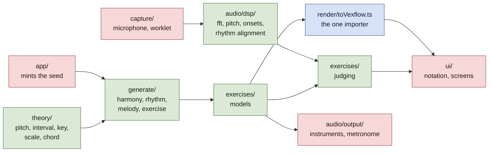

# Architecture decision records

One record per decision that would be expensive to reverse or puzzling to
inherit. Records are **append-only**: once a record is published its argument is
never rewritten, only its status changed to `Superseded by NNNN`. A later
decision that narrows an earlier one says so on its own face.

Numbering is sequential, four digits, and never reused. **Claim a number before
you write, with `.claude/scripts/fleet.sh adr-claim "<title>"`.** It allocates
against every number that exists anywhere — on any branch, in any worktree's
working tree including an uncommitted draft, and in the claims file — rather
than against what anyone remembers agreeing. Reserving by message does not work:
a reservation and the work it was meant to protect can cross in flight.
`fleet.sh adr-taken` shows who holds what.

| # | Decision | Status |
| --- | --- | --- |
| [0001](0001-a-pure-core.md) | A pure core: theory, generate and dsp import nothing above themselves | Accepted |
| [0002](0002-generation-is-reproducible-from-its-seed.md) | Generation is reproducible from its seed | Accepted |
| [0003](0003-one-importer-for-the-notation-library.md) | One importer for the notation library | Accepted |
| [0004](0004-harmony-stays-symbolic-until-it-is-spelled.md) | Harmony stays symbolic until it is spelled | Accepted |
| [0005](0005-seeds-are-minted-outside-the-core.md) | Seeds are minted outside the core | Accepted |
| [0006](0006-settings-in-localstorage-progress-in-indexeddb.md) | Settings in localStorage, progress in IndexedDB | Accepted |
| [0007](0007-an-attempt-records-per-event-item-attribution.md) | An attempt records per-event item attribution | Accepted |
| [0008](0008-an-onset-is-a-rise-in-the-frames-own-spectrum.md) | An onset is a rise in the frame's own spectrum | Accepted |
| [0009](0009-align-a-performance-by-dynamic-programming.md) | Align a performance by dynamic programming, not by nearest neighbour | Accepted |
| [0010](0010-presentation-is-part-of-what-an-attempt-means.md) | Presentation is part of what an attempt means | Accepted |
| [0011](0011-what-a-catalogue-owes.md) | What a catalogue owes | Accepted |
| [0012](0012-the-judge-consumes-performed-notes-not-audio.md) | The judge consumes performed notes, not audio | Accepted |
| [0013](0013-knowing-the-answer-narrows-what-judging-has-to-do.md) | Knowing the answer narrows what judging has to do | Accepted |
| [0014](0014-one-clock-and-the-latency-nobody-can-measure.md) | One clock, and the latency nobody can measure | Accepted |
| [0015](0015-state-keyed-to-the-exercise-type-must-not-outlive-it.md) | State keyed to the exercise type must not outlive it | Accepted |
| [0016](0016-widen-the-query-not-the-corpus.md) | Widen the query, not the corpus, and only when it pays on its own | Accepted |
| [0017](0017-a-setting-that-excludes-is-not-a-corpus-you-cannot-reach.md) | A setting that excludes is not a corpus you cannot reach | Accepted |
| [0018](0018-uncalibrated-is-not-zero.md) | Uncalibrated is not zero | Accepted |
| [0019](0019-the-click-gap-stays-the-callers-and-the-margin-stops-being-a-comment.md) | The click gap stays the caller's, and the margin stops being a comment | Accepted |
| [0020](0020-by-ear-the-unit-is-the-sounding-key.md) | By ear, the unit is the sounding key | Superseded by [0028](0028-a-question-only-absolute-pitch-can-answer.md) |
| [0021](0021-a-catalogues-top-grade-must-be-reachable.md) | A catalogue's top grade must be reachable, and cell ids are not frozen yet | Superseded by [0027](0027-configure-by-naming-what-an-exercise-contains.md) |
| [0022](0022-an-outcome-for-evidence-that-was-never-shown.md) | An outcome for evidence that was never shown | Superseded by [0028](0028-a-question-only-absolute-pitch-can-answer.md) |
| [0023](0023-a-document-cannot-cite-its-own-commit.md) | A document cannot cite its own commit | Accepted |
| [0024](0024-the-progress-view-lists-what-was-tested.md) | The progress view lists what was tested, not what was shown | Accepted |
| [0025](0025-agreement-among-trials-that-share-an-error-is-not-confidence.md) | Agreement among trials that share an error is not confidence | Accepted |
| [0026](0026-a-measurement-signal-does-not-inherit-a-listening-level.md) | A measurement signal does not inherit a listening level | Accepted |
| [0027](0027-configure-by-naming-what-an-exercise-contains.md) | Configure an exercise by naming what it contains, not by a difficulty ordinal | Accepted |
| [0028](0028-a-question-only-absolute-pitch-can-answer.md) | A question only absolute pitch can answer is not a hard question | Accepted |
| [0029](0029-a-prompt-is-a-component-and-may-use-one.md) | A prompt is a component, and may use one | Accepted |
| [0030](0030-a-corpus-can-weight-the-catalogue-but-cannot-write-it.md) | A corpus can weight the catalogue, but cannot write it | Accepted |
| [0031](0031-a-control-may-not-resolve-a-contradiction-it-is-still-displaying.md) | A control may not resolve a contradiction it is still displaying | Accepted |
| [0032](0032-the-generator-is-a-draw-not-a-search.md) | The generator is a draw, not a search | Accepted |
| [0033](0033-a-motif-is-a-preference-and-harmony-is-allowed-to-win.md) | A motif is a preference, and harmony is allowed to win | Accepted |
| [0034](0034-test-data-that-cannot-be-committed-is-fetched-and-its-absence-is-announced.md) | Test data that cannot be committed is fetched, and its absence is announced | Accepted |
| [0035](0035-an-onset-is-an-attack-a-note-is-a-decision-about-attacks.md) | An onset is an attack; a note is a decision about attacks | Accepted |
| [0036](0036-one-question-two-windows.md) | One question, two windows | Accepted |
| [0037](0037-a-schedule-is-per-presentation-and-the-home-screen-is-not.md) | A schedule is per presentation, and the home screen is not | Accepted |
| [0038](0038-preserve-unknown-settings-at-the-store-not-at-the-coercer.md) | Preserve unknown settings at the store, not at the coercer | Accepted |
| [0039](0039-a-line-is-an-exercise-and-the-items-its-settings-make-askable.md) | A line is an exercise and the items its settings make askable | Accepted |
| [0040](0040-completion-replaces-the-score.md) | Completion replaces the score | Accepted |
| [0041](0041-practice-that-counts-towards-nothing.md) | Practice that counts towards nothing | Accepted |
| [0042](0042-history-is-disposable-until-settings-settle.md) | History is disposable until settings settle | Accepted |
| [0043](0043-an-instrument-is-not-part-of-what-a-line-measures.md) | An instrument is not part of what a line measures | Accepted |
| [0044](0044-deterministic-is-not-the-same-as-seeded.md) | Deterministic is not the same as seeded | Accepted |
| [0045](0045-an-instrument-may-change-how-a-note-is-produced-never-which-note-is-correct.md) | An instrument may change how a note is produced, never which note is correct | Accepted |
| [0046](0046-a-sampled-pack-is-fetched-on-use-not-precached.md) | A sampled pack is fetched on use, not precached | Accepted |
| [0047](0047-hearing-nothing-and-not-hearing-are-different-answers.md) | Hearing nothing and not hearing are different answers | Accepted |

**Ten conventions follow, in the order they were learned.** They are prose
rather than headings because each is an argument with its instances attached,
but that makes the run of them long — so, to find one, search its opening
words:

1. *Check a claim about the code against the code* — not the record that made it.
2. *A description of work is not the work* — including the author's own, and most of all a description of **checking**.
3. *Scope a guard to what can actually change the thing it guards* — and the silent half, where too narrow is blind rather than noisy.
4. *Before deleting a test as a tautology* — ask whether it can fail for some input the test actually explores.
5. *A comment that states a constraint is a test that cannot fail* — and its inverse, code that rounded.
6. *State what you measured through* — not only what you measured.
7. *A claim's altitude decides whether anything can falsify it* — a summary needs a mechanism its parts do not.
8. *A claim about what the user wants* — the only kind nothing in the repository can contradict.
9. *A guard must be able to fail* — a sound assertion over an empty or unlucky population is the usual way it cannot.
10. *A reason attached to working code* — unfalsifiable because the code is right — and its dual, *a distinction the type cannot state*; with the one constructive move against both, *pin the behaviour that exists*.

**Check a claim about the code against the code, not against the record that
made it.** One unchecked reading of `CLAUDE.md` became four wrong documents in
two days: 0012 read a description of what `audio/dsp/` is *for* as a statement
of what it holds, 0013 cited 0012, this index drew it, and the published report
repeated it. No single step looked like an invention, and the claim — that the
DSP layer computes chroma, which it does not — was load-bearing for an exercise
about to be built on it. Both records now carry dated corrections.

**The same rule reaches data this project did not write, where the record
that made the claim is a filename or a readme.** Two instances inside one
feature, both about sample libraries:

- **Pitch.** Four of six instrument packs shipped an octave sharp, because the
  builder read the note a file was *called*. A file named `C4` is middle C
  under one octave convention and not under the other; VSCO writes middle C as
  C3, FreePats writes C4, and VCSL is inconsistent between its own
  sub-libraries. The builder measures each recording's fundamental now and
  refuses a set that disagrees with its labels.
- **Licence.** One library's repository metadata says CC0 while its readme
  asks for more; another states CC0 only inside the downloaded archive, where
  neither the project page nor the repository metadata shows it. The allowlist
  decides what is permitted; a person still opens the package.

**Imported metadata is a claim by somebody outside this repository, and it is
the only kind no amount of reading our own code can check.** The remedy is the
first convention's, pointed outward: go to the thing itself — measure the
audio, open the archive — rather than to the description that travelled with
it.

**A description of work is not the work, and that holds when the description is
the author's own and offered in good faith.** On 6 October four claims about
shipped code arrived by message from the person who had just written it, each
accurate as far as its author could see, and checking all four against the tree
changed the answer four times: a test said to exercise capture imported one
pure helper, a guard said to be fixed matched a directory rather than a
mechanism, a scope said to be tighter was aimed away from the only place the
wiring can appear, and a chain said to be proven end to end was proven on
synthesised input. **Nobody was careless and the rate was four in four**, which
is the rate to expect rather than a bad afternoon — an author's reading of
their own work is the one reading taken from inside it.

**The sharpest form of this is a description of *checking*, and it is the one
that stops anyone else looking.** On 9 October a proposal for the eighth
convention below named the wrong file for one of its two instances. The
reviewing session — this one — grepped that file, found the one assertion the
description got right, accepted the sentence around it, and published the
convention saying both instances had been verified against the tree. The
author of the proposal caught it afterwards, from memory, and checked the
files again rather than relying on the review.

**"I verified the half that was true and reported the whole as checked."**
That is the fault, and it is worse than the four above rather than another of
them. A description of work invites a reader to check it, which is what makes
the four-in-four rate recoverable. A description of *having checked* does the
opposite: it is the one claim whose acceptance guarantees nobody repeats the
work, so an overstatement in it is self-sealing.

The cure is not more care, which was already present. It is to **say which
part was checked and by what, rather than that it was checked** — "grepped
this file for a population assertion and found one at line 171" cannot be
mistaken for "confirmed both instances", and the gap between them is visible
to the reader rather than only to the author.

The *working* rule that follows — read the code once it is synced rather than
building on what a message said about it, because a merge gets independent
review by construction and a message does not — belongs to the fleet protocol
and lives in its skill, which is shared across projects and outside this
repository. The instances stay here because they are this repository's, and
the principle stays with them because a reader of the public tree cannot open
the skill.

**Scope a guard to what can actually change the thing it guards.** A check that
fires on changes it should ignore is not merely annoying: the noise is how it
comes to be ignored, and an ignored check is worse than none, because everyone
believes it is still running. Three instances in one day, all the same shape —
the layering rule matched the word "window" in a sentence about a signal frame,
and the report's staleness check cried wolf twice, once comparing the bundle
against `HEAD` rather than against the files that can change it, and once
counting test files that are never bundled. Each was narrowed after it had
already taught someone to skim past it.

**The same scoping error also runs the other way, and that half is silent.** A
guard scoped too narrowly does not become noisy; it becomes blind, and it still
reads as a guard. `passage.ts` derives three rng streams from the caller's, and
a draw inserted *above* the derivations silently re-seeds every layer — ADR
[0002](0002-generation-is-reproducible-from-its-seed.md)'s promise broken while
its letter holds, because every existing check passes. The first guard written
for it pinned the seeds `deriveStreams` returns, **which is the callee when the
hazard is in the caller**: the inserted draw survived it. The second rebuilt
each layer from the stream it should have been handed, which catches that and
survives the three streams being permuted, because the rebuild asks for them by
name and permutes with them. Both are in, each documented as catching what the
other cannot.

So the question to ask of a guard is not only "does it fire on things it should
ignore" but **"is the thing it watches the thing that can change"** — and the
second has no symptom until the day it matters. Only running the mutant tells
you, which is why a guard nobody has watched fail is a guard nobody knows works.

**Before deleting a test as a tautology, ask: can this fail for some input in
its domain, or only for inputs the present system cannot construct?** The first
is a corner worth covering. The second is a tautology wearing a corner's
clothes — and the convention above, read carelessly, argues for deleting both.

The question separates a guard from a definition. A guard asserts a property of
the system as it stands, so it is scoped to what can change that property, and
if nothing can it should go: the menu test that compared a derived name against
the name it was derived from was deleted rather than kept as documentation. A
definition answers a question over a domain, and is tested over that domain
rather than over the inputs its current callers happen to produce.
`isBorrowedIn` says whether a chord is a loan from the parallel mode; that
`vii°` in minor is not one is true whether or not any template writes it today,
so that branch is an untested corner and not dead code.

**A comment that states a constraint is a test that cannot fail, so check the
constraint and not the comment.** Three instances in one day, and the first two
caused the defects they described. `keys.ts` opens by forbidding exactly the
enharmonic marking the by-ear path then did — "An exercise that showed two
sharps and accepted only 'D major' would be marking a correct answer wrong" —
and [0020](0020-by-ear-the-unit-is-the-sounding-key.md) is that comment being
true and unenforced. `KeyPrompt.tsx` opened "the prompt is deliberately silent:
this is a reading exercise, so there is nothing to play", which was true when
written and was falsified by `presentations: ['read', 'listen']` being added
past it; the exercise then advertised a listening mode and sounded nothing. The
third was a test rather than a comment — the applied-chord exemption in
`isBorrowedIn`, whose only example was the one applied chord that returns false
with the exemption deleted.

**A fourth instance is worth having because it forecloses a misreading the
other three invite.** On 10 October `tools/build-instrument-pack.mjs` said
*"**No guitar.** Neither library has one… It stays synthesised until there is a
real one"* — fifty-five lines above the guitar entry, in the same file, added
by the same author in the same sitting. A third library had one after all, and
nobody read upward.

Both of the comment instances above are *distance* failures: a claim in one
file contradicted by a path in another, and a claim falsified later by a change
made past it. (The third is a different fault — a test whose single example
could not fail.) Two cases both shaped that way is how this convention gets
read as **watch comments that sit far from what they describe**, which is
comfortably wrong and would license skipping the near ones. **This instance had
no distance to accumulate**: the contradiction fitted on a screen, and it was
still shipped. Distance is not the variable, which is the sharpest support yet
for the convention's own claim that the remedy is not more care.

All four are confidence without a check, and the confidence is what did the
damage: a comment stating a constraint reads like an assurance that somebody is
enforcing it, so the next reader does not look. **A constraint worth writing in
a comment is worth a test, and the comment should point at the test.** Where
that is not possible, say what is unenforced rather than stating the rule as
though it holds.

**That remedy has a known failure mode, and it is this convention inverted.**
Three cases in two days were comments that did not lie over code that rounded —
a stiffness term documented for *upper* partials and applied to the fundamental
too, an envelope documented as decaying and holding, a direction promised to
the seed and taken by first match. Checking the claim against the code passes
in all three, because both are right to the precision anyone reads them at. The
remedy there is a mutant aimed at the gap rather than a closer reading;
[`docs/misread-instruments.md`](../misread-instruments.md) carries the
argument.

**A fourth instance is the strongest, and it is a different and worse case than
a stale comment.** `Round`'s own doc comment in `PracticeScreen.tsx` reads:

> Frozen at generation. Changing the settings mid-exercise must not change the
> exercise or the answers on offer — **narrowing the interval list could
> otherwise take the correct answer off the screen** — and it is also what the
> attempt records, so it has to be what was actually used.

That is not a constraint that went stale. It is the exact defect that then
shipped, **named in advance with its precise consequence**, in the type the
screen was using — while the prompt two hundred lines away rendered its choice
list from live settings. A learner narrowed the pool to two intervals, unticked
the answer, clicked the only button left, and was marked wrong.

The rule was not forgotten, which is what makes it worth recording separately.
It was written down, **honoured in one of the two places it governed** — the
attempt path takes `presentation` from the exercise and says in its own comment
why — and the other was never checked against it. Two comments in one file,
one of them describing the failure the other was about to permit.

**State what you measured *through*, not only what you measured.** A
reachability finding is a statement about a catalogue and an instrument
together, and the instrument has a range of its own. Where that range is not
written down it gets attributed to the subject, and the finding reads as a
fact about the thing when it is a fact about the question that was asked of
it.

The cases are in [`docs/misread-instruments.md`](../misread-instruments.md):
four instances, the counter-example that shows the cost of getting it right is
one sentence, and three accounts of how the mistake felt from inside. The
useful form of the rule is a question — **what else changed when I changed the
thing I was testing?**

This is close to a sibling rule in `CLAUDE.md` — when a mechanism exists to
answer a question directly, a correlate of the answer is not a substitute for
running it — and is not the same fault. **That one is reaching for a correlate
when the mechanism is available**: a matching test count is not
`git merge-base`, and a name you constructed is not a name `ListAgents` gave
you. **This one is using a legitimate instrument and not stating its range**,
so a true measurement supports a conclusion wider than itself. The first
substitutes the wrong tool; the second over-reads the right one.

**The one-line version, from the person it happened to: _you read the trip as
The fuller write-up of the first lives in `docs/process/`, which is deliberately
not in the repository, so the distinction is stated here rather than cited —
a reader of the public tree cannot open that file.

**A claim's altitude decides whether anything can falsify it, so a summary
needs a mechanism its parts do not.** A statement about one thing sits beside
that thing and gets checked against it. The sentence that generalises over many
sits above every check that could contradict it, and rots without a symptom —
not through carelessness, but because nothing is positioned to disagree with
it.

Four instances, each found separately and none by the check that should have
caught it:

- The home screen's lede said the app is "answered by playing them" while all
  six built exercises were answered by clicking. **Every exercise card was
  honest; only the banner was not**, because each card is checked against its
  own exercise and nothing checks the sentence summarising all six.
- `ARCHITECTURE.md`'s "What is not built" had three of four entries false, for
  days. A claim that something *exists* is contradicted the moment a reader
  opens the file; a claim that something is absent is contradicted by nobody,
  because building it does not prompt anyone to delete its entry.
- [0011](0011-what-a-catalogue-owes.md)'s prose said "three of thirty-three
  templates" over a table, in the same record, summing to thirty-five. The
  detail was right and the sentence above it was wrong.
- `ROADMAP.md`'s item-id table named `rhythm:`, `harmony:` and `read:`
  prefixes that no exercise writes, while every exercise emitted its ids
  correctly.

The remedy is not vigilance. **A summary should be generated from what it
summarises, or carry the command that checks it, or not exist.**
`tools/report-facts.sh` is the worked example of the first
([0023](0023-a-document-cannot-cite-its-own-commit.md)), and "What is not
built" carried two commands as the second.

**The three are not equal, and the week of 11 October tested two of them
against each other.** "What is not built" rotted a *second* time with its
commands in place — three of four entries false again, one of them
contradicted by a passing test in the same repository. The lede claim, bound
to a fact in `src/architecture.test.ts`, flipped on its own in the same week.

**The reason is who each remedy addresses.** A command in a document is run by
someone reading the document, and **the reader is not who makes it stale** —
the writer of the next feature is, and they never arrive at the file. Nobody
who built the capture layer had any reason to open `ARCHITECTURE.md`. A claim
bound to a fact needs no reader at all: it fails in the suite of the person
who falsified it, at the moment they do.

So the ordering is: **bind it to a fact, or let it not exist. Carrying a
command is a third-best that has now failed once and should be chosen only
where the claim genuinely cannot be bound** — and then per entry, not as two
commands at the top of a list, since a reader who skips the list skips the
commands with it.

That these four were fixed on four different days, in four different
documents, without anyone noticing they were one fault is the convention
demonstrating itself: each was checked locally and nothing summarised them.

**The remedy has since been built and has fired, which is worth recording
because everything above this line is a failure.** A convention illustrated
only by things going wrong gives a reader no way to tell whether its advice
works or is merely sensible-sounding.

`src/architecture.test.ts` carries the home screen's lede — the first instance
above — as a case. It went red when the capture adapter landed and the
sentence had not caught up, and green when the sentence did; main reports it as
the second such test to flip on its own rather than being edited.

**The design detail is what makes it work, and it is the opposite of the
obvious implementation.** It does not snapshot the sentence. A reworded lede
that still claims playing as a present capability fails it, and the wording is
free to change in every other way, because what is checked is **the fact the
wording has to answer to** — whether any exercise actually hands a response to
the capture layer rather than to a click. A test on the string would have been
brittle, would have failed on every rewrite for no reason, and would have been
deleted within a month; a test on the fact survives rewording and cannot be
satisfied by it.

It is also deliberately one-directional. It catches claiming a capability with
nothing behind it, and lets the opposite — building something and not saying so
— pass. That asymmetry is why going green on its own is safe rather than a
missed alarm: a quiet app is a smaller fault than a lying one.

**A claim about what the user wants is a claim too, and it is the only kind
nothing in the repository can contradict.** Every convention above points at
statements about the code, where a grep, a test or a second reader eventually
disagrees. A sentence reporting what the user decided has none of that: it
cannot be checked against the tree, no guard turns red, and the one person
positioned to correct it is the one being quoted — who is not reading the
record.

[0040](0040-completion-replaces-the-score.md) carries the instance. Its
addendum recorded a ruling accurately in substance and overstated it in three
small ways at once: a parenthetical aside was quoted as a standalone sentence,
the user's own "maybe" was built on as settled, and an ambiguous phrase was
resolved to one of its two readings without the choice being visible. The
record then became the source for a second one. Nothing was invented and the
drift was all in the same direction, which is the tell: tidying a quotation
makes it more decisive, never less.

It surfaced only because another agent had not seen the message and said so
rather than assuming it had missed one. That is the mechanism, and it is thin —
it works when a second party exists and speaks up. **So the rule is on the
writer: quote the user verbatim, keep their hedges, and where a phrase has two
readings record that it has two rather than picking one silently.** An
inference drawn from what they said is this project's argument and should be
written as this project's argument, under its own heading, where someone can
disagree with it without appearing to contradict the user.

**A guard must be able to fail, and a sound assertion over nothing is the way
it most often cannot.** This is the fourth convention's predicate — a test that
cannot fail — reached by a different route and needing a different cure. There
the constraint was never wired to anything; here it is wired correctly and runs
over a population that could not have contained the failure.

Two instances, found by the tester a day apart and both now fixed:

- **A population that is structurally empty.** `src/packCoverage.test.tsx`
  mounts the practice screen for each exercise, presses Start, collects what
  the app hands to `audio.play`, and asserts those pitches lie inside the
  compass an instrument can be recorded over. Renaming the button to *Begin*
  as a mutant gave **"3 failed | 1 passed" — and the one that passed was the
  compass claim**, because an exercise that never started asks for no pitches
  and no pitch is outside the compass. The population cases failed; the claim
  did not.

  `src/ui/labelling.test.tsx` is the same fault by a different route: its
  population is read off disk, so what breaks it is removing a screen from
  the table rather than breaking a press, and its own vacuity guard asks
  whether the screens it swept actually drew their controls.
- **A case that is drawn at random and did not come up.**
  `PracticeScreen.test.tsx` narrowed a pool to two and walked eight rounds
  hoping to reach the one where the drawn answer was the unticked interval.
  That is a coin eight times: **one run in 256 finished having proved
  nothing**, failed on its own control, and reported the defect against
  whichever commit was passing through the shared gate at that moment. It cost
  two sessions an afternoon and nearly cost a retraction that would have left
  the real fault in the tree.

**They are one convention because the cure is one, not because the cause is.**
Structurally empty and stochastically unlucky are different faults — the first
can never contain the case, the second merely did not. What they share is the
remedy: **assert that the case occurred, in its own assertion, separately from
asserting what it shows.** A sweep states the size of what it swept; a
randomised walk draws until it reaches its case, bounded, and fails loudly at
the bound rather than falling off the end.

**And both fail disguised as something else**, which is why neither was caught
by reading. The empty sweep looks green. The unlucky walk looks like somebody
else's bug — the most expensive disguise available, because it sends people to
investigate a commit that was innocent.

**One cure that looks right and is not, measured rather than reasoned about.**
`expect.assertions(n)` is the first thing anyone reaches for. On the unfixed
test with the seed stubbed, the passing run makes eighteen assertions and the
unlucky run also makes eighteen: the control runs and fails, nothing
short-circuits, and the count never reports. It counts assertions. It cannot
see that an assertion ran over nothing.

[`docs/misread-instruments.md`](../misread-instruments.md) carries the same
fault from the instrument's side and has the longer argument; what is here is
the rule the next sweep needs, which is not a thing a test can hold.

**A reason attached to working code is a claim, and it is the one kind no test
can falsify.** Every convention above concerns a claim something could
contradict — the code, a guard, a measurement, a reader. This one cannot be
contradicted by anything in the repository, because **the code is right**. The
tests pass, the behaviour is correct, and the account of *why* it is correct is
false. Nothing is positioned to disagree, since every prediction the comment
makes comes true.

Two instances, both caught by a reader who was not the author, and both of
code that needed no change:

- `completion`'s denominator was credited with stopping a narrowed pool from
  flattering a learner. It does not: narrowing shrinks `askable`, which *is*
  the denominator, so on its own the fraction would rise. What prevents it is
  one level up — `lineKey` is built from the sorted askable set, so a narrowed
  pool is a different line reading 0. The function was correct throughout.
- The instrument pack's container was chosen because "the manifest and the
  audio must not be separable". True, and it does not decide anything: both
  candidate formats were a single file. The container is right for different
  reasons — a base64 payload would not have avoided the slicing arithmetic and
  would have held the audio twice, as a UTF-16 string.

**This project is unusually exposed to it**, and by its own conventions rather
than by accident: comments here explain *why* and not *what*, so the comments
it values most are precisely the ones made of unfalsifiable material.

**The cost is deferred and lands on whoever edits next.** A reader who
preserves the stated reason can destroy the real one. Nothing in front of
someone simplifying `tallyKey` said that a figure on the home screen depended
on it; the comment that should have said so was busy crediting the denominator.

**The remedy is a thought experiment, since a test is unavailable: ask what
would break if the stated reason were false.** If the answer is nothing, the
reason is not carrying the weight it claims. The denominator's account fails
that in one step — were line identity not tied to the askable set, narrowing
*would* inflate the figure, so the denominator cannot be the thing preventing
it.

Four in one day by the author's own count, each found by a different reader
and never by the author — who is, necessarily, the person who found the reason
satisfying.

**A distinction the type cannot state is the ninth's dual, and it is worse.**
There the code is right and the account of it is false, so nothing disagrees.
Here the account is right and **the world has a state the model cannot hold**,
so nothing disagrees for the opposite reason: there is no observation that
would differ.

`Log` could not say whether what was written to it survived. An empty history
and an unreachable one returned the same value, threw nothing, and were
identical in every observable — so no test could have told them apart, and no
amount of care in writing one would have helped. Not a false reason: an
**unstateable** one.

**Three of this week's defects lived there and presented identically.** An
absent instrument pack, a pruned one, and a faulty measurement of an absent
one all surfaced as "the synthesised voice is playing and nothing is wrong".
[0046](0046-a-sampled-pack-is-fetched-on-use-not-precached.md) argued for that
floor and did not notice it was also building a place for faults to hide.

**The positive precedent is in the repository and was deliberate**, which is
what makes this actionable rather than only cautionary. `ProgressStatus` is
`'loading' | 'ready' | 'unavailable'` — three states because two would let a
blocked store look exactly like a new profile, which
[0006](0006-settings-in-localstorage-progress-in-indexeddb.md) foresaw and
named.

**The remedy is a different question from the ninth's**, and it is the more
actionable of the two: ask what two different situations would *look* like,
and notice when they look the same. The tell is that you cannot write the
test — if you set out to assert the difference and find there is no expression
for it, that is the finding, and the fix belongs in the type rather than in
the suite.

**There is one constructive move against both of the above, and it is the
only one in this list: pin the behaviour that exists, with the open question
named in the case.** The ninth and tenth describe claims nothing is positioned
to contradict. Where the contradiction is a record and the code drifting
apart, and resolving it is somebody else's call, the choice is not between
fixing it and saying nothing.

`completion` ignores the clock: `streak` falls on a wrong answer and never
with elapsed time, so a line whose items all reach the top rung reads 1 for
ever, including for a learner who stopped a year ago.
[0040](0040-completion-replaces-the-score.md) says there is no done and argues
a reading should drift back while nobody practises. Nothing drifts. What a
learner should see after doing everything right and then stopping is a product
question and open, so neither the architect nor the tester could answer it.

`schedule.test.ts` now pins the drift-free behaviour and says in the case that
**it pins the behaviour that exists, not the one that should**, citing the
record. Simulating an answer — decaying the streak by a month's staleness —
turns three cases red including that one.

**What it buys is a reader that cannot forget.** Without the case, the day
somebody answers the product question the change lands green and nobody
rereads 0040. With it, the suite fails loudly and the failure message points at
the record that has been waiting. That matters here specifically: this project
has already had a user's ruling sit four days in a file synced into the
worktree of the role named in it.

**The counterintuitive part is that pinning behaviour you do not endorse looks
exactly like endorsing it**, and only the comment separates them — which makes
this the one place a comment is load-bearing rather than decorative. The fifth
convention says a constraint worth a comment is worth a test and the comment
should point at the test. This is that reversed: a test whose job is to point
at a record.

**Checking more and checking exactly pull in opposite directions, and that is
the point.** The first convention says check more — no claim about the code
rides on the record that made it. The second says check exactly — a guard fires
only on what can change the thing it guards. They meet because a guard broad
enough to be noisy and a claim nobody ever checks fail in the same place: at the
moment someone decides the signal is not worth reading. The third says which
kind of thing you are holding before you apply either; the fourth is the first
one again, pointed at prose, because a comment is a claim about the code and
goes stale exactly the way a record does; and the fifth is the first one
pointed at a finding, because a measurement is a claim too, and it carries its
instrument whether or not anyone writes the instrument down. The sixth is the
first one pointed upwards: a summary is a claim about every claim beneath it,
and it is the one position from which nothing below can answer back. The
seventh points outwards, at the one claim with no local evidence at all —
what the user asked for — where the check cannot be a mechanism and has to be
a habit of quoting exactly. The eighth turns the whole set on the checks
themselves: every convention above assumes that a guard which runs is a guard
that could have failed, and that assumption is the one none of them examine.
The ninth is the only one with nothing to check against at all — the code is
right, so the repository agrees with a false account of it, and the fault
surfaces years later in whoever edits on the strength of it.

[`docs/judging-chain.md`](../judging-chain.md) reads 0007, 0012, 0013, 0014,
0018 and 0020 as one argument, because five of them are the same rule meeting a
new kind of ignorance and no single record says so.

[`docs/ARCHITECTURE.md`](../ARCHITECTURE.md) describes the system as it stands
today and links back to these records. It is a living document: when a record
and it disagree, the record says what was decided and ARCHITECTURE.md says what
is true now.

## The shape of the thing

The green boxes are plain TypeScript over plain data: no DOM, no
`AudioContext`, no React, no persistence. That is what lets the whole music
engine and the whole analysis chain run under vitest on a laptop
([0001](0001-a-pure-core.md)), and it is the constraint most worth protecting.
Everything the platform supplies enters at the edges, and the notation library
enters at exactly one file ([0003](0003-one-importer-for-the-notation-library.md)).

The seed is drawn red deliberately. Minting one is the single act of
nondeterminism in the whole pipeline, and since
[0005](0005-seeds-are-minted-outside-the-core.md) it happens above the core and
is handed in — so the arrow into `generate/` is the entropy boundary, not just
another dependency.



None of the three is a module boundary — nothing in the language stops a later
branch importing `document` into the generator — so each is worth being able to
ask of the repository directly:

```bash
# 0001 — nothing in the core reaches for the platform.
grep -rn 'document\.\|window\.\|AudioContext\|navigator\.\|localStorage' \
  src/theory src/generate src/audio/dsp

# 0002, narrowed by 0005 — no entropy reaches the core at all.
grep -rn 'Math\.random\|crypto\.getRandomValues' src/theory src/generate

# 0003 — one file imports the notation library.
git ls-files 'src/*' | xargs grep -l "from 'vexflow'"
```

The first two should print nothing and the third exactly one path, ending
`render/toVexflow.ts`. They are asked of directories that do not all exist yet;
as `generate/` and `audio/dsp/` land, the greps start covering them without
being edited, which is the point of writing them this way rather than against a
file list.

These are now enforced, by [`src/architecture.test.ts`](../../src/architecture.test.ts),
which asks all three of the repository on every run. It walks the filesystem
rather than `git ls-files`, so an untracked file breaches the rules too, and it
asserts the core directories are non-empty first so that the rules fail loudly
if `theory/` ever moves instead of reporting a vacuous pass.

Each rule has been mutation-tested rather than trusted: a platform API, a stray
`Math.random`, a clock read, an unsorted `Set` spread, a React import and a
second vexflow importer were each introduced and confirmed to turn the suite
red — twenty-one mutations in all, covering every alternative of every rule
rather than one per rule.

That distinction is the whole lesson. Three rules originally passed mutations
they should have caught, and each was hidden by a sibling alternative that
matched instead. `new AudioContext()` slipped through a `{` standing where a
word boundary belonged. The entropy rule checked that `rng.ts` was the only
*file* calling `Math.random` rather than that `randomSeed` was the only
*caller*, so a second generator beside it passed — since made moot by
[0005](0005-seeds-are-minted-outside-the-core.md), which admits no entropy at
all. And the upward-import rule matched only single quotes, so `from "react"`
walked through it, while the vexflow mutation that should have exposed that was
being caught by the 0003 rule instead. A guard nobody has watched fail is a
guard nobody knows works, and mutating a rule is not the same as mutating every
branch of it.

## Template

```markdown
# ADR NNNN — Title

- **Status:** Accepted
- **Date:** YYYY-MM-DD

## Context
## Decision
## Consequences
### What this costs
## Revisit when
```
