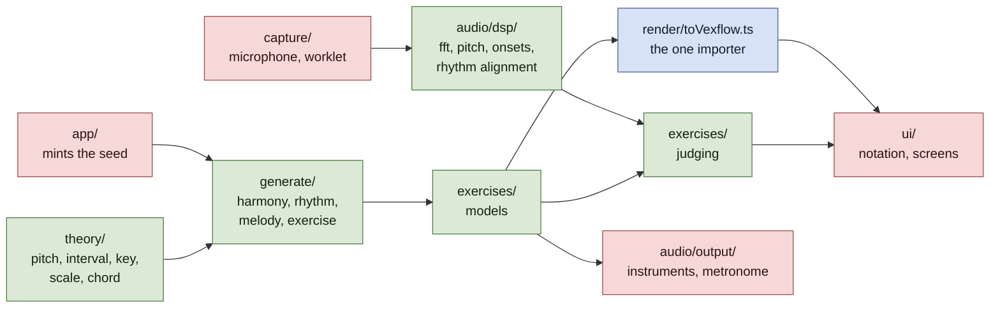

# Architecture decision records

One record per decision that would be expensive to reverse or puzzling to
inherit. Records are **append-only**: once a record is published its argument is
never rewritten, only its status changed to `Superseded by NNNN`. A later
decision that narrows an earlier one says so on its own face.

Numbering is sequential, four digits, and never reused. **Claim a number before
you write, with `.claude/scripts/fleet.sh adr-claim "<title>"`.** It allocates
against every number that exists anywhere — on any branch, in any worktree's
working tree including an uncommitted draft, and in the claims file — rather
than against what anyone remembers agreeing. Reserving by message does not work:
a reservation and the work it was meant to protect can cross in flight.
`fleet.sh adr-taken` shows who holds what.

| # | Decision | Status |
| --- | --- | --- |
| [0001](0001-a-pure-core.md) | A pure core: theory, generate and dsp import nothing above themselves | Accepted |
| [0002](0002-generation-is-reproducible-from-its-seed.md) | Generation is reproducible from its seed | Accepted |
| [0003](0003-one-importer-for-the-notation-library.md) | One importer for the notation library | Accepted |
| [0004](0004-harmony-stays-symbolic-until-it-is-spelled.md) | Harmony stays symbolic until it is spelled | Accepted |
| [0005](0005-seeds-are-minted-outside-the-core.md) | Seeds are minted outside the core | Accepted |
| [0006](0006-settings-in-localstorage-progress-in-indexeddb.md) | Settings in localStorage, progress in IndexedDB | Accepted |
| [0007](0007-an-attempt-records-per-event-item-attribution.md) | An attempt records per-event item attribution | Accepted |
| [0008](0008-an-onset-is-a-rise-in-the-frames-own-spectrum.md) | An onset is a rise in the frame's own spectrum | Accepted |
| [0009](0009-align-a-performance-by-dynamic-programming.md) | Align a performance by dynamic programming, not by nearest neighbour | Accepted |
| [0010](0010-presentation-is-part-of-what-an-attempt-means.md) | Presentation is part of what an attempt means | Accepted |
| [0011](0011-what-a-catalogue-owes.md) | What a catalogue owes | Accepted |
| [0012](0012-the-judge-consumes-performed-notes-not-audio.md) | The judge consumes performed notes, not audio | Accepted |
| [0013](0013-knowing-the-answer-narrows-what-judging-has-to-do.md) | Knowing the answer narrows what judging has to do | Accepted |
| [0014](0014-one-clock-and-the-latency-nobody-can-measure.md) | One clock, and the latency nobody can measure | Accepted |
| [0015](0015-state-keyed-to-the-exercise-type-must-not-outlive-it.md) | State keyed to the exercise type must not outlive it | Accepted |
| [0016](0016-widen-the-query-not-the-corpus.md) | Widen the query, not the corpus, and only when it pays on its own | Accepted |
| [0017](0017-a-setting-that-excludes-is-not-a-corpus-you-cannot-reach.md) | A setting that excludes is not a corpus you cannot reach | Accepted |
| [0018](0018-uncalibrated-is-not-zero.md) | Uncalibrated is not zero | Accepted |
| [0019](0019-the-click-gap-stays-the-callers-and-the-margin-stops-being-a-comment.md) | The click gap stays the caller's, and the margin stops being a comment | Accepted |
| [0020](0020-by-ear-the-unit-is-the-sounding-key.md) | By ear, the unit is the sounding key | Superseded by [0028](0028-a-question-only-absolute-pitch-can-answer.md) |
| [0021](0021-a-catalogues-top-grade-must-be-reachable.md) | A catalogue's top grade must be reachable, and cell ids are not frozen yet | Superseded by [0027](0027-configure-by-naming-what-an-exercise-contains.md) |
| [0022](0022-an-outcome-for-evidence-that-was-never-shown.md) | An outcome for evidence that was never shown | Superseded by [0028](0028-a-question-only-absolute-pitch-can-answer.md) |
| [0023](0023-a-document-cannot-cite-its-own-commit.md) | A document cannot cite its own commit | Accepted |
| [0024](0024-the-progress-view-lists-what-was-tested.md) | The progress view lists what was tested, not what was shown | Accepted |
| [0025](0025-agreement-among-trials-that-share-an-error-is-not-confidence.md) | Agreement among trials that share an error is not confidence | Accepted |
| [0026](0026-a-measurement-signal-does-not-inherit-a-listening-level.md) | A measurement signal does not inherit a listening level | Accepted |
| [0027](0027-configure-by-naming-what-an-exercise-contains.md) | Configure an exercise by naming what it contains, not by a difficulty ordinal | Accepted |
| [0028](0028-a-question-only-absolute-pitch-can-answer.md) | A question only absolute pitch can answer is not a hard question | Accepted |
| [0029](0029-a-prompt-is-a-component-and-may-use-one.md) | A prompt is a component, and may use one | Accepted |
| [0030](0030-a-corpus-can-weight-the-catalogue-but-cannot-write-it.md) | A corpus can weight the catalogue, but cannot write it | Accepted |
| [0031](0031-a-control-may-not-resolve-a-contradiction-it-is-still-displaying.md) | A control may not resolve a contradiction it is still displaying | Accepted |
| [0032](0032-the-generator-is-a-draw-not-a-search.md) | The generator is a draw, not a search | Accepted |
| [0033](0033-a-motif-is-a-preference-and-harmony-is-allowed-to-win.md) | A motif is a preference, and harmony is allowed to win | Accepted |
| [0034](0034-test-data-that-cannot-be-committed-is-fetched-and-its-absence-is-announced.md) | Test data that cannot be committed is fetched, and its absence is announced | Accepted |
| [0035](0035-an-onset-is-an-attack-a-note-is-a-decision-about-attacks.md) | An onset is an attack; a note is a decision about attacks | Accepted |
| [0036](0036-one-question-two-windows.md) | One question, two windows | Accepted |

**Check a claim about the code against the code, not against the record that
made it.** One unchecked reading of `CLAUDE.md` became four wrong documents in
two days: 0012 read a description of what `audio/dsp/` is *for* as a statement
of what it holds, 0013 cited 0012, this index drew it, and the published report
repeated it. No single step looked like an invention, and the claim — that the
DSP layer computes chroma, which it does not — was load-bearing for an exercise
about to be built on it. Both records now carry dated corrections.

**A description of work is not the work, and that holds when the description is
the author's own and offered in good faith.** On 6 October four claims about
shipped code arrived by message from the person who had just written it, each
accurate as far as its author could see, and checking all four against the tree
changed the answer four times: a test said to exercise capture imported one
pure helper, a guard said to be fixed matched a directory rather than a
mechanism, a scope said to be tighter was aimed away from the only place the
wiring can appear, and a chain said to be proven end to end was proven on
synthesised input. **Nobody was careless and the rate was four in four**, which
is the rate to expect rather than a bad afternoon — an author's reading of
their own work is the one reading taken from inside it.

The *working* rule that follows — read the code once it is synced rather than
building on what a message said about it, because a merge gets independent
review by construction and a message does not — belongs to the fleet protocol
and lives in its skill, which is shared across projects and outside this
repository. The instances stay here because they are this repository's, and
the principle stays with them because a reader of the public tree cannot open
the skill.

**Scope a guard to what can actually change the thing it guards.** A check that
fires on changes it should ignore is not merely annoying: the noise is how it
comes to be ignored, and an ignored check is worse than none, because everyone
believes it is still running. Three instances in one day, all the same shape —
the layering rule matched the word "window" in a sentence about a signal frame,
and the report's staleness check cried wolf twice, once comparing the bundle
against `HEAD` rather than against the files that can change it, and once
counting test files that are never bundled. Each was narrowed after it had
already taught someone to skim past it.

**The same scoping error also runs the other way, and that half is silent.** A
guard scoped too narrowly does not become noisy; it becomes blind, and it still
reads as a guard. `passage.ts` derives three rng streams from the caller's, and
a draw inserted *above* the derivations silently re-seeds every layer — ADR
[0002](0002-generation-is-reproducible-from-its-seed.md)'s promise broken while
its letter holds, because every existing check passes. The first guard written
for it pinned the seeds `deriveStreams` returns, **which is the callee when the
hazard is in the caller**: the inserted draw survived it. The second rebuilt
each layer from the stream it should have been handed, which catches that and
survives the three streams being permuted, because the rebuild asks for them by
name and permutes with them. Both are in, each documented as catching what the
other cannot.

So the question to ask of a guard is not only "does it fire on things it should
ignore" but **"is the thing it watches the thing that can change"** — and the
second has no symptom until the day it matters. Only running the mutant tells
you, which is why a guard nobody has watched fail is a guard nobody knows works.

**Before deleting a test as a tautology, ask: can this fail for some input in
its domain, or only for inputs the present system cannot construct?** The first
is a corner worth covering. The second is a tautology wearing a corner's
clothes — and the convention above, read carelessly, argues for deleting both.

The question separates a guard from a definition. A guard asserts a property of
the system as it stands, so it is scoped to what can change that property, and
if nothing can it should go: the menu test that compared a derived name against
the name it was derived from was deleted rather than kept as documentation. A
definition answers a question over a domain, and is tested over that domain
rather than over the inputs its current callers happen to produce.
`isBorrowedIn` says whether a chord is a loan from the parallel mode; that
`vii°` in minor is not one is true whether or not any template writes it today,
so that branch is an untested corner and not dead code.

**A comment that states a constraint is a test that cannot fail, so check the
constraint and not the comment.** Three instances in one day, and the first two
caused the defects they described. `keys.ts` opens by forbidding exactly the
enharmonic marking the by-ear path then did — "An exercise that showed two
sharps and accepted only 'D major' would be marking a correct answer wrong" —
and [0020](0020-by-ear-the-unit-is-the-sounding-key.md) is that comment being
true and unenforced. `KeyPrompt.tsx` opened "the prompt is deliberately silent:
this is a reading exercise, so there is nothing to play", which was true when
written and was falsified by `presentations: ['read', 'listen']` being added
past it; the exercise then advertised a listening mode and sounded nothing. The
third was a test rather than a comment — the applied-chord exemption in
`isBorrowedIn`, whose only example was the one applied chord that returns false
with the exemption deleted.

All three are confidence without a check, and the confidence is what did the
damage: a comment stating a constraint reads like an assurance that somebody is
enforcing it, so the next reader does not look. **A constraint worth writing in
a comment is worth a test, and the comment should point at the test.** Where
that is not possible, say what is unenforced rather than stating the rule as
though it holds.

**State what you measured *through*, not only what you measured.** A
reachability finding is a statement about a catalogue and an instrument
together, and the instrument has a range of its own. Where that range is not
written down it gets attributed to the subject, and the finding reads as a
fact about the thing when it is a fact about the question that was asked of
it.

The cases are in [`docs/misread-instruments.md`](../misread-instruments.md):
four instances, the counter-example that shows the cost of getting it right is
one sentence, and three accounts of how the mistake felt from inside. The
useful form of the rule is a question — **what else changed when I changed the
thing I was testing?**

This is close to a sibling rule in `CLAUDE.md` — when a mechanism exists to
answer a question directly, a correlate of the answer is not a substitute for
running it — and is not the same fault. **That one is reaching for a correlate
when the mechanism is available**: a matching test count is not
`git merge-base`, and a name you constructed is not a name `ListAgents` gave
you. **This one is using a legitimate instrument and not stating its range**,
so a true measurement supports a conclusion wider than itself. The first
substitutes the wrong tool; the second over-reads the right one.

**The one-line version, from the person it happened to: _you read the trip as
The fuller write-up of the first lives in `docs/process/`, which is deliberately
not in the repository, so the distinction is stated here rather than cited —
a reader of the public tree cannot open that file.

**A claim's altitude decides whether anything can falsify it, so a summary
needs a mechanism its parts do not.** A statement about one thing sits beside
that thing and gets checked against it. The sentence that generalises over many
sits above every check that could contradict it, and rots without a symptom —
not through carelessness, but because nothing is positioned to disagree with
it.

Four instances, each found separately and none by the check that should have
caught it:

- The home screen's lede said the app is "answered by playing them" while all
  six built exercises were answered by clicking. **Every exercise card was
  honest; only the banner was not**, because each card is checked against its
  own exercise and nothing checks the sentence summarising all six.
- `ARCHITECTURE.md`'s "What is not built" had three of four entries false, for
  days. A claim that something *exists* is contradicted the moment a reader
  opens the file; a claim that something is absent is contradicted by nobody,
  because building it does not prompt anyone to delete its entry.
- [0011](0011-what-a-catalogue-owes.md)'s prose said "three of thirty-three
  templates" over a table, in the same record, summing to thirty-five. The
  detail was right and the sentence above it was wrong.
- `ROADMAP.md`'s item-id table named `rhythm:`, `harmony:` and `read:`
  prefixes that no exercise writes, while every exercise emitted its ids
  correctly.

The remedy is not vigilance. **A summary should be generated from what it
summarises, or carry the command that checks it, or not exist.**
`tools/report-facts.sh` is the worked example of the first
([0023](0023-a-document-cannot-cite-its-own-commit.md)), and "What is not
built" now carries two commands as the second.

That these four were fixed on four different days, in four different
documents, without anyone noticing they were one fault is the convention
demonstrating itself: each was checked locally and nothing summarised them.

**Checking more and checking exactly pull in opposite directions, and that is
the point.** The first convention says check more — no claim about the code
rides on the record that made it. The second says check exactly — a guard fires
only on what can change the thing it guards. They meet because a guard broad
enough to be noisy and a claim nobody ever checks fail in the same place: at the
moment someone decides the signal is not worth reading. The third says which
kind of thing you are holding before you apply either; the fourth is the first
one again, pointed at prose, because a comment is a claim about the code and
goes stale exactly the way a record does; and the fifth is the first one
pointed at a finding, because a measurement is a claim too, and it carries its
instrument whether or not anyone writes the instrument down. The sixth is the
first one pointed upwards: a summary is a claim about every claim beneath it,
and it is the one position from which nothing below can answer back.

[`docs/judging-chain.md`](../judging-chain.md) reads 0007, 0012, 0013, 0014,
0018 and 0020 as one argument, because five of them are the same rule meeting a
new kind of ignorance and no single record says so.

[`docs/ARCHITECTURE.md`](../ARCHITECTURE.md) describes the system as it stands
today and links back to these records. It is a living document: when a record
and it disagree, the record says what was decided and ARCHITECTURE.md says what
is true now.

## The shape of the thing

The green boxes are plain TypeScript over plain data: no DOM, no
`AudioContext`, no React, no persistence. That is what lets the whole music
engine and the whole analysis chain run under vitest on a laptop
([0001](0001-a-pure-core.md)), and it is the constraint most worth protecting.
Everything the platform supplies enters at the edges, and the notation library
enters at exactly one file ([0003](0003-one-importer-for-the-notation-library.md)).

The seed is drawn red deliberately. Minting one is the single act of
nondeterminism in the whole pipeline, and since
[0005](0005-seeds-are-minted-outside-the-core.md) it happens above the core and
is handed in — so the arrow into `generate/` is the entropy boundary, not just
another dependency.



None of the three is a module boundary — nothing in the language stops a later
branch importing `document` into the generator — so each is worth being able to
ask of the repository directly:

```bash
# 0001 — nothing in the core reaches for the platform.
grep -rn 'document\.\|window\.\|AudioContext\|navigator\.\|localStorage' \
  src/theory src/generate src/audio/dsp

# 0002, narrowed by 0005 — no entropy reaches the core at all.
grep -rn 'Math\.random\|crypto\.getRandomValues' src/theory src/generate

# 0003 — one file imports the notation library.
git ls-files 'src/*' | xargs grep -l "from 'vexflow'"
```

The first two should print nothing and the third exactly one path, ending
`render/toVexflow.ts`. They are asked of directories that do not all exist yet;
as `generate/` and `audio/dsp/` land, the greps start covering them without
being edited, which is the point of writing them this way rather than against a
file list.

These are now enforced, by [`src/architecture.test.ts`](../../src/architecture.test.ts),
which asks all three of the repository on every run. It walks the filesystem
rather than `git ls-files`, so an untracked file breaches the rules too, and it
asserts the core directories are non-empty first so that the rules fail loudly
if `theory/` ever moves instead of reporting a vacuous pass.

Each rule has been mutation-tested rather than trusted: a platform API, a stray
`Math.random`, a clock read, an unsorted `Set` spread, a React import and a
second vexflow importer were each introduced and confirmed to turn the suite
red — twenty-one mutations in all, covering every alternative of every rule
rather than one per rule.

That distinction is the whole lesson. Three rules originally passed mutations
they should have caught, and each was hidden by a sibling alternative that
matched instead. `new AudioContext()` slipped through a `{` standing where a
word boundary belonged. The entropy rule checked that `rng.ts` was the only
*file* calling `Math.random` rather than that `randomSeed` was the only
*caller*, so a second generator beside it passed — since made moot by
[0005](0005-seeds-are-minted-outside-the-core.md), which admits no entropy at
all. And the upward-import rule matched only single quotes, so `from "react"`
walked through it, while the vexflow mutation that should have exposed that was
being caught by the 0003 rule instead. A guard nobody has watched fail is a
guard nobody knows works, and mutating a rule is not the same as mutating every
branch of it.

## Template

```markdown
# ADR NNNN — Title

- **Status:** Accepted
- **Date:** YYYY-MM-DD

## Context
## Decision
## Consequences
### What this costs
## Revisit when
```
