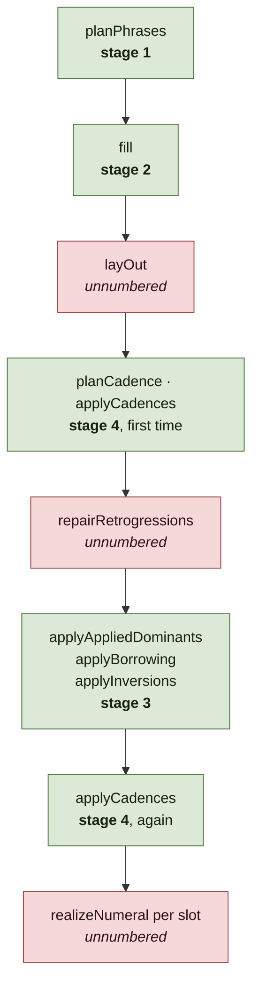

# The harmony pipeline, as described and as run

Asked of [`harmony.ts`](../src/generate/harmony.ts): are the four stages its
header describes the four the function runs? **No.** The order is wrong, two
stages are missing from the list, one of the four runs twice, and the file's
own section markers already know — they disagree with the header twelve lines
above them.

Nothing here is a defect in the music. The generator does the right thing; the
description of how is what has drifted. This document takes no decisions and
makes no source changes; it ends with the one question that needs deciding.

## Contents

- [Described against run](#described-against-run)
- [Cadence is a bracket, not a stage](#cadence-is-a-bracket-not-a-stage)
- [The two stages nobody numbered](#the-two-stages-nobody-numbered)
- [Symbolic until the last moment, except twice](#symbolic-until-the-last-moment-except-twice)
- [The one thing that needs deciding](#the-one-thing-that-needs-deciding)

## Described against run

The header says "four stages that happen in this order for reasons no
chord-to-chord process can supply": phrase plan, filling, transformations,
cadence enforcement.

`generateHarmony` runs:



Stage 3 runs after stage 4, not before it. The header's "in this order" is the
only claim in it that is false, and it is the claim the numbering exists to
make.

**The file already disagrees with its own header.** Its section markers read:

```
// ---- Stage 1: the phrase plan ----
// ---- Stage 2a: the two-level functional machine ----
// ---- Stage 2b: filling the plan ----
// ---- Stage 4, decided early: the cadences ----
// ---- Stage 3: the transformations ----
```

"Stage 4, decided early" is exactly right and is twelve lines of scrolling away
from a header that says otherwise. A reader meets the header first.

## Cadence is a bracket, not a stage

The deeper point is that "decided early" undersells it. Cadences are not early;
they are **on both sides of the transformations**, and the sandwich is the
design:

- `planCadence` computes the writes from the slots as they stand, once.
- `applyCadences` writes them and sets `locked` on each slot it touched.
- The three transformations and `repairRetrogressions` all skip locked slots —
  checked, at [`harmony.ts`](../src/generate/harmony.ts) in
  `applyAppliedDominants`, `applyBorrowing`, `applyInversions` and
  `repairRetrogressions`.
- `applyCadences` runs again with the same writes.

So the first application is what gives the transformations something to
respect, and the second re-asserts it. A four-item list cannot express that,
which is why the header's shape is wrong rather than just its order: cadence
enforcement is not the fourth thing that happens, it is the constraint the
third thing operates inside.

## The two stages nobody numbered

`layOut` converts bars to ticks before anything asks where in the bar a chord
falls. Its own comment says it happens "once, before anything asks", which is a
sequencing guarantee — the kind of thing the stage list exists to record.

`repairRetrogressions` runs between the cadences and the transformations and is
filed under the Stage 3 marker, though it is not a transformation in the sense
[0016](adr/0016-widen-the-query-not-the-corpus.md) and
[0017](adr/0017-a-setting-that-excludes-is-not-a-corpus-you-cannot-reach.md)
use the word: those gate passes that *add* chords on `allowAppliedDominants`
and `allowBorrowed`, and this one repairs a progression that already exists,
ungated.

Neither is a defect. Both are load-bearing sequencing that the description
omits.

## Symbolic until the last moment, except twice

The header closes: "Everything is symbolic until the last moment… and
`realizeNumeral` spells it". [0004](adr/0004-harmony-stays-symbolic-until-it-is-spelled.md)
is firmer — "the harmony generator therefore moves between *functions* … and
never between pitches."

`realizeNumeral` is called twice in the generator, not once. The second is the
output. The first is `bassNote`, which spells a chord to find its bass, and it
is consulted throughout stage 3 — by `sixFourKind` and by `applyInversions`,
which costs candidate inversions by how far the bass moves in staff steps.

0004's principle survives: the generator's *representation* stays numerals and
its state transitions are functional. What is false is the stronger reading the
header invites. **Pitches are computed in the middle of the pipeline, and
deliberately** — choosing an inversion by bass motion is a pitch question and
could not be answered any other way. The risk is a later reader deleting that
call on 0004's authority and breaking inversion selection, which is the kind of
mistake a too-strong summary causes.

## The one thing that needs deciding

Everything above is description catching up with code. This is not.

**The second `applyCadences` cannot currently change anything.** All four
mutators check `locked`, so by the time it runs, every slot it would write
already holds the value it would write. Its comment claims it is what "makes
that a fact rather than a convention" — but it is not a guard. It does not
assert and it does not report. It silently overwrites.

The consequence shows up in the case it exists for. If a fifth transformation
is added and forgets the `locked` check, the second application will quietly
undo its work on cadence slots. The generator will look correct, the new
transformation will be partly ineffective on exactly the chords that matter
most, and nothing will fail. That is worse than either alternative: an
assertion would name the bug, and deleting the call would let the bug show.

This is the distinction `docs/adr/README.md` draws between a guard and a
definition, in a third shape — a **repair** standing where a guard was
intended. The question to settle is whether it should assert that no locked
slot changed, or go, and the answer wants whoever next touches this file. It is
small either way and it is the only thing in this document that is not
bookkeeping.
