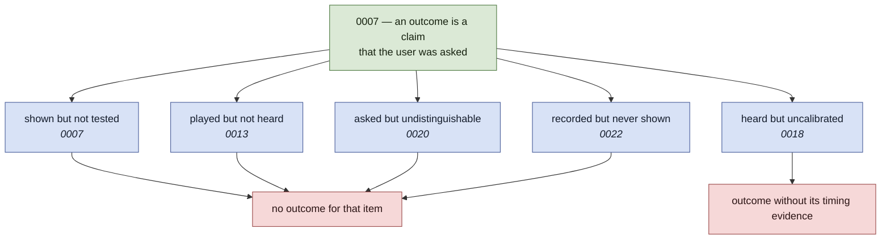

# What judging knows, and what it may claim

A reading of [0007](adr/0007-an-attempt-records-per-event-item-attribution.md),
[0012](adr/0012-the-judge-consumes-performed-notes-not-audio.md),
[0013](adr/0013-knowing-the-answer-narrows-what-judging-has-to-do.md),
[0014](adr/0014-one-clock-and-the-latency-nobody-can-measure.md),
[0018](adr/0018-uncalibrated-is-not-zero.md),
[0020](adr/0020-by-ear-the-unit-is-the-sounding-key.md) and
[0022](adr/0022-an-outcome-for-evidence-that-was-never-shown.md) end to end, asking
whether they still cohere. **They do**, and more tightly than any one of them
says — five of the seven are the same rule meeting a new kind of ignorance. This
document names the rule, because a chain nobody has read as a chain is one that
drifts at the next link.

It is a living document and takes no decisions. Where it disagrees with a
record, the record is what was decided.

## Contents

- [The rule](#the-rule)
- [The rungs](#the-rungs)
- [Gap one: 0020 does not cite the ladder it climbed](#gap-one-0020-does-not-cite-the-ladder-it-climbed)
- [Gap two: equivalence lives in two places](#gap-two-equivalence-lives-in-two-places)

## The rule

[0007](adr/0007-an-attempt-records-per-event-item-attribution.md) states it in
one line — **an outcome is a claim that the user was asked** — and then applies
it to a single case: items the exercise contained but did not test get nothing,
not a credit and not a blame.

Everything after it is that line meeting a new reason the user might not have
been asked. The reasons are unrelated to each other. The response is identical
every time: **record no outcome, rather than a confident wrong one.**

The shape worth noticing is that the five causes sit at different layers — the
generator, the detector, the device, music theory, and a grader's own
bookkeeping — and none of them could
have been anticipated from the others. That the same answer served each time is
the evidence that 0007 picked the right rule rather than a convenient one.

## The rungs

**[0007](adr/0007-an-attempt-records-per-event-item-attribution.md) — shown but
not tested.** `items` is what the rendering contained; `outcomes` is what the
response tested. Keeping both is what lets a schedule tell *never shown* from
*shown and not tested*.

**[0012](adr/0012-the-judge-consumes-performed-notes-not-audio.md) — the judge
never sees audio.** Not an application of the rule but the seam that makes the
rest possible: a performance is an array of notes, from a microphone or from
MIDI, and `grade` cannot tell which. Its contribution to the chain is negative
and important — `clarity` and `levelDbfs` stop at the seam, because a judge
that branched on them "would be judging iOS users by a different rule from
everyone else."

**[0013](adr/0013-knowing-the-answer-narrows-what-judging-has-to-do.md) —
played but not heard.** An inconclusive hearing produces no outcome at all. Low
confidence means *nothing was heard*, a fact about the room; recording it as a
failure "would do it systematically to whoever has the worst room."

**[0018](adr/0018-uncalibrated-is-not-zero.md) — heard but uncalibrated.** The
one rung that produces a partial outcome rather than none: the attempt is
graded, pitch is unaffected, and only `latencyMs` is withheld. 0018 says
outright that it is applying 0013's rule "to a second kind of it", which is why
this chain is legible at all — it is the only record that names the pattern.

**[0020](adr/0020-by-ear-the-unit-is-the-sounding-key.md) — asked but
undistinguishable.** Six enharmonic key pairs sound identical, so a listener
marked wrong for answering "F♯ major" to a G♭ cadence generates a row claiming
they were asked a question nobody can be asked.

**[0022](adr/0022-an-outcome-for-evidence-that-was-never-shown.md) — recorded
but never shown.** `gradeKey` wrote a `signature:` outcome on every attempt,
including by ear, where the staff is deliberately empty. **It inverts 0020
exactly, which is why it is worth its own rung rather than a footnote to that
one.** 0020 collapsed the *key* question because the ear cannot separate G♭
from F♯; the signature is the thing that separates them, six flats against six
sharps, so by ear it is not merely untested but unanswerable in principle — and
it was the item being recorded with confidence. The same grader held the
chain's subtlest application and its plainest violation.

[0014](adr/0014-one-clock-and-the-latency-nobody-can-measure.md) is the odd one
and belongs in the chain for a different reason: it is where the *evidence*
comes from rather than what may be claimed about it. 0018 is its narrowing, and
the two should be read together or not at all.

## Gap one: 0020 does not cite the ladder it climbed

0020 derives its argument from 0007 directly and mentions neither 0013 nor
0018. It is not wrong — 0007 is the binding constraint and the derivation
holds — but a reader coming down the chain meets the fourth application of a
rule presented as a fresh discovery, and the compounding evidence that the rule
is a good one is invisible at exactly the record that most demonstrates it.

0022 inherits the same gap: it cites 0007 and 0020 and not the rungs between.

Nothing needs changing in the records. This document is the fix, provided
something links to it.

## Gap two: equivalence lives in two places

This one is decision-shaped and nothing reconciles it.

**0012:** "What counts as equivalent is the exercise's business, which is why it
lives in `grade` and not in the capture layer." A chord played an octave up or
in another inversion is the same answer, and the grader is where that is
decided.

**0020:** deliberately keeps `grade` one-to-one and collapses the *question*
instead — the by-ear pool holds one key per sounding tonic, and widening the
answer was rejected because "collapsing the question is honest; widening the
answer is not."

Both are right, and the reason is a distinction neither states: **equivalence
belongs in `grade` when the input space is open, and in the answer set when the
input space is yours.** A performance cannot be constrained — the user will play
some voicing, and the grader must accept many performances as one answer. A list
of buttons can be constrained, so the ambiguity can be removed from the question
before it reaches the grader.

**This becomes load-bearing the moment key identification is answered by
playing**, which is the whole direction 0012 sets and the premise of the app.
There is no choice list to collapse when the answer is a performance: a user
plays a cadence, and the grader has to accept the sounding tonic however it is
spelled. 0020's mechanism evaporates and 0012's rule has to carry the same
ambiguity — one-to-many in `grade`, which is precisely what 0020 rejected for
the clicking case.

That is not a contradiction today. It is a tripwire, and 0020's "Revisit when"
does not carry it, which is why it is written down here and noted on 0020
itself. Whoever builds performance-answered key identification should expect to
need a record, and should expect it to narrow 0020 rather than supersede it:
the two mechanisms suit two input shapes and the app will have both.
